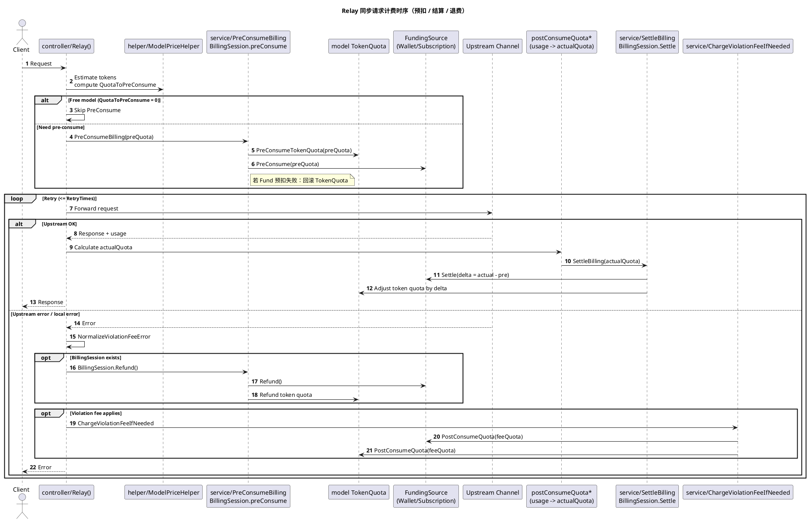
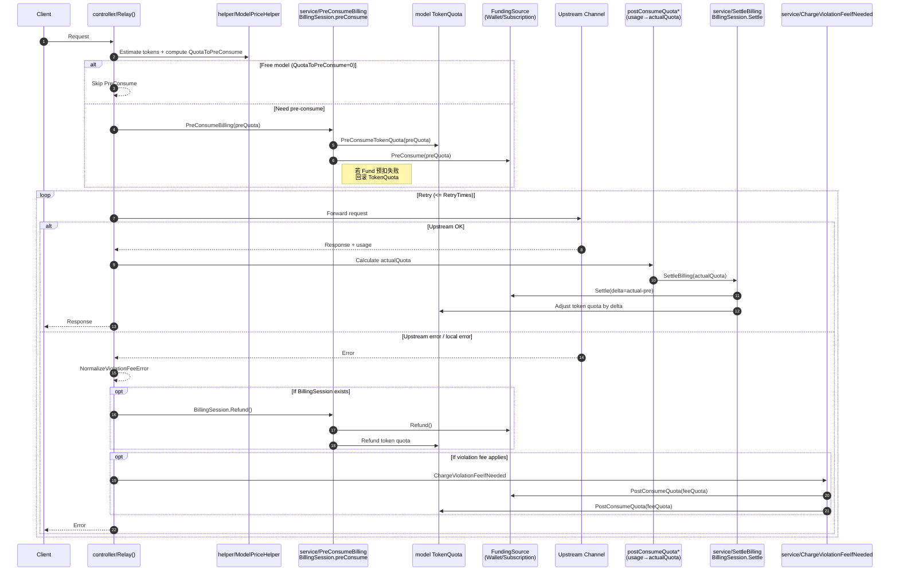
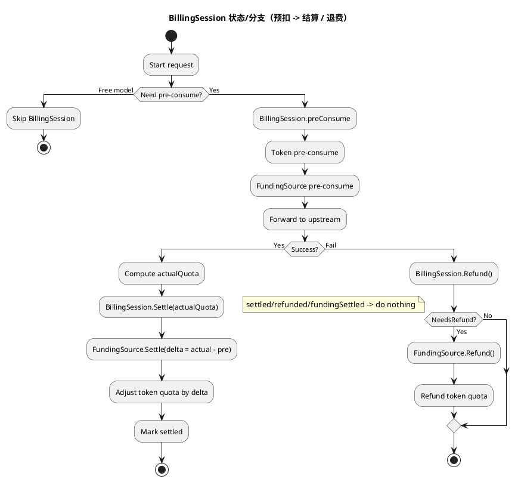
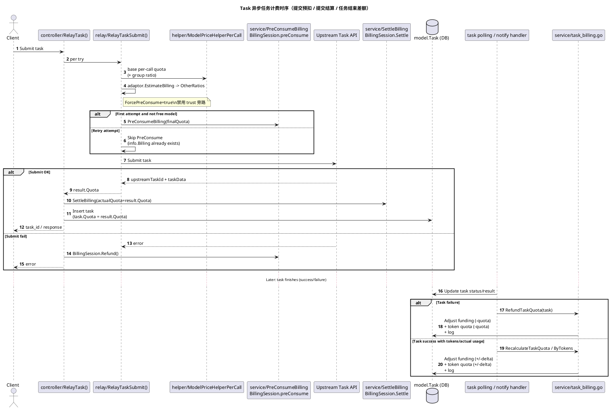
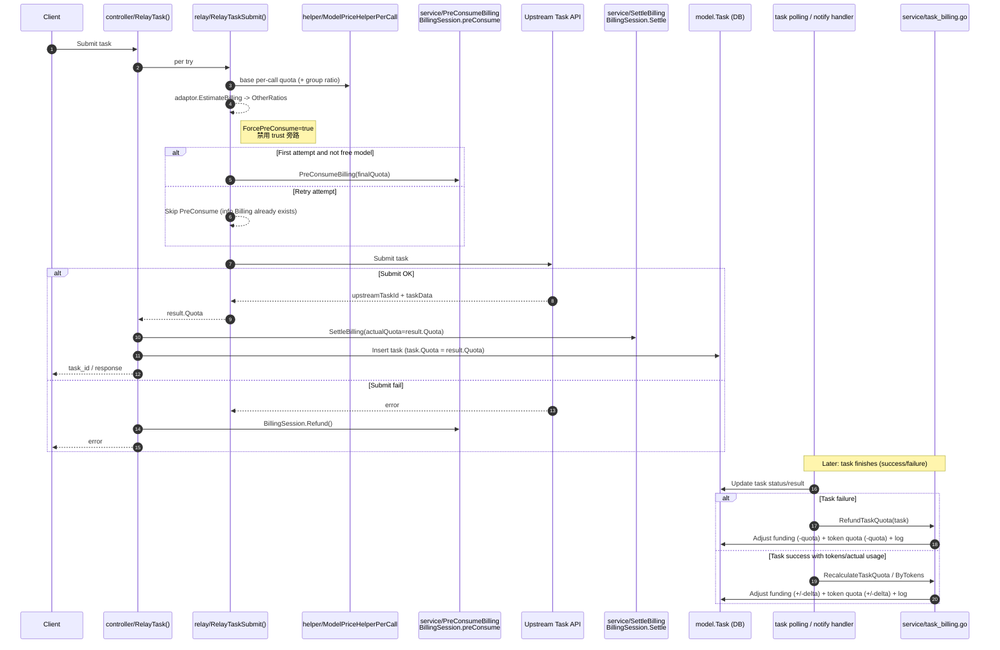

# 请求渠道扣费逻辑梳理（预扣费 / 失败退费 / 成功扣费）

本文档基于当前仓库实现，对**一次请求**从进入网关到完成结算的扣费流程做“从代码到流程”的梳理，覆盖：

- **预扣费**（PreConsume）：请求发往上游前先锁定额度，避免成功后无余额可扣
- **失败退费**（Refund）：上游失败/网关判定失败时退还已预扣额度
- **成功结算**（Settle）：按上游真实 usage 计算实际费用，与预扣做差额“补扣/退还”
- **异步任务**（Task）：提交阶段预扣 + 成功后结算；任务失败退款；成功后可做 token 重算差额
- **特殊收费**：违规罚金（Violation fee）、工具调用额外计费（Responses/WebSearch/FileSearch 等）

---

## 1. 核心概念与数据结构

### 1.1 扣费的“两个账户”

系统在一次请求里会同时处理两类额度：

- **用户额度（wallet quota / subscription quota）**：用户钱包余额或订阅额度
- **令牌额度（token quota）**：API Key 对应的 token 的剩余额度（token.RemainQuota）

你可以把它理解成：**用户账户**与**Token 账户**都需要扣；预扣/结算/退费都要尽量保持一致。

代码里，预扣与后结算被统一封装为一个会话 `BillingSession`。

### 1.3 关键方法中文释义（建议先读这张表）

> 这部分是“看代码时的中文索引”。你看到某个函数名时，可以立刻知道它在计费链路里扮演的角色。

#### 1.3.1 同步请求（Relay）主链路

- **`controller/Relay()`**：同步转发入口，负责“解析请求 → 估算 tokens → 预扣 → 选渠道/重试 → 成功结算 / 失败退费+罚金”整条链路编排。
- **`service.EstimateRequestToken()`**：估算请求 prompt tokens（用于预扣费估算），不依赖上游返回 usage。
- **`helper.ModelPriceHelper()`**：计算**预扣额度**（`PriceData.QuotaToPreConsume`）以及倍率/价格参数（模型倍率、分组倍率、completionRatio、cacheRatio 等），并写入 `relayInfo.PriceData`。
- **`service.PreConsumeBilling()`**：统一预扣入口。内部创建 `BillingSession` 并执行 `BillingSession.preConsume()`；预扣成功后把会话挂到 `relayInfo.Billing` 上。
- **`service.SettleBilling()`**：统一“成功后结算”入口。优先走 `BillingSession.Settle(actualQuota)` 做差额补扣/退还；没有 BillingSession 时回退到旧逻辑 `PostConsumeQuota()`。
- **`BillingSession.Refund()`**：失败退费入口。只在“尚未结算且确实发生预扣”的情况下退还（幂等保护：`settled/refunded/fundingSettled`）。
- **`relay/compatible_handler.go::postConsumeQuota()`**：根据上游返回的 usage 计算**实际扣费额度 actualQuota**（包含 tokens、cache/image/audio/tool calls 等），然后调用 `SettleBilling()` 落账。

#### 1.3.2 BillingSession（预扣/结算/退费状态机）

- **`service.NewBillingSession()`**：根据用户偏好（订阅优先/钱包优先/仅订阅/仅钱包）创建会话，并处理订阅↔钱包 fallback。
- **`BillingSession.preConsume(quota)`**：执行预扣（可能经过“信任额度旁路”把 effectiveQuota 置 0），顺序为：
  - 先预扣 token quota（`PreConsumeTokenQuota`）
  - 再预扣资金来源（`FundingSource.PreConsume`）
  - 任一步失败就回滚已完成步骤（例如资金预扣失败回滚 token）
- **`BillingSession.Settle(actualQuota)`**：成功后结算，计算差额 \(delta = actualQuota - preConsumedQuota\)，并按 delta 对资金来源与 token quota 做补扣/退还。
- **`BillingSession.NeedsRefund()`**：判断当前是否存在“需要退还的预扣状态”（订阅在 tokenConsumed=0 时也可能预扣）。

#### 1.3.3 资金来源（FundingSource）

- **`WalletFunding.PreConsume/Settle/Refund`**：钱包扣费/退费实现。注意钱包退款 `IncreaseUserQuota` **非幂等**，所以逻辑上不应重试（代码里也明确提示）。
- **`SubscriptionFunding.PreConsume`**：订阅预扣实现，调用 `model.PreConsumeUserSubscription(requestId, ...)` 创建幂等预扣记录并锁定订阅额度。
- **`SubscriptionFunding.Refund`**：订阅退款实现，调用 `model.RefundSubscriptionPreConsume(requestId)`（幂等），并包了一层有限重试 `refundWithRetry()`。
- **`SubscriptionFunding.Settle(delta)`**：订阅差额结算，调用 `model.PostConsumeUserSubscriptionDelta(subscriptionId, delta)`。

#### 1.3.4 订阅幂等记录（model/subscription.go）

- **`model.PreConsumeUserSubscription(requestId, ...)`**：订阅“预扣”事务：`FOR UPDATE` 锁定活跃订阅 → 写入 `SubscriptionPreConsumeRecord`（requestId 幂等）→ 增加 `AmountUsed`。
- **`model.RefundSubscriptionPreConsume(requestId)`**：订阅“退还预扣”事务：锁定预扣记录 → 若未退款则对订阅做 `-preConsumed` 的 delta 回滚 → 标记记录 refunded（幂等）。
- **`model.PostConsumeUserSubscriptionDelta(subId, delta)`**：订阅结算差额 delta 的统一函数（delta 可正可负）。

#### 1.3.5 异步任务（Task）

- **`controller/RelayTask()`**：异步任务入口，负责编排“提交重试 → 成功结算+入库 / 失败退费”。
- **`relay/RelayTaskSubmit()`**：单次提交尝试：计算按次价格 + 估算 OtherRatios → 首次预扣（`ForcePreConsume=true` 禁用信任旁路）→ 提交上游 → 得到最终 quota。
- **`service/task_billing.go::RefundTaskQuota()`**：任务失败后退款（退资金来源 + 退 token + 写 task billing log）。
- **`service/task_billing.go::RecalculateTaskQuota()`**：任务成功后的差额结算（actual - pre），可补扣或退还。
- **`service/task_billing.go::RecalculateTaskQuotaByTokens()`**：任务返回 totalTokens 时，按倍率重算实际费用并调用 `RecalculateTaskQuota()`。

#### 1.3.6 特殊收费

- **`service.NormalizeViolationFeeError()`**：将特定上游违规错误归一为“违规罚金”可识别的错误码，并强制 skip-retry。
- **`service.ChargeViolationFeeIfNeeded()`**：在失败退费后，若命中违规策略，额外扣一笔罚金（通过 `PostConsumeQuota` 直接落账，绕过 BillingSession）。

### 1.2 RelayInfo：请求期的计费上下文

所有计费都围绕 `relay/common/relay_info.go` 的 `RelayInfo` 展开，其中与计费强相关字段包括：

- `RequestId`：用于订阅预扣/退费的幂等键
- `PriceData`：价格/倍率/预扣额度等
- `Billing`：`BillingSession`（免费模型时可能为空）
- `FinalPreConsumedQuota`：最终预扣额度（兼容旧逻辑）
- `BillingSource`：`wallet` 或 `subscription`
- `Subscription*`：订阅预扣与结算的上下文（订阅 id、预扣额、差额结算 delta、套餐信息等）

见：

```85:171:/Users/linyous/Desktop/new-project/new-api/relay/common/relay_info.go
type RelayInfo struct {
  // ... 省略 ...
  FinalPreConsumedQuota int
  ForcePreConsume bool
  Billing BillingSettler
  BillingSource string
  SubscriptionId int
  SubscriptionPreConsumed int64
  SubscriptionPostDelta int64
  SubscriptionPlanId int
  SubscriptionPlanTitle string
  RequestId string
  SubscriptionAmountTotal int64
  SubscriptionAmountUsedAfterPreConsume int64
  PriceData types.PriceData
  // ... 省略 ...
}
```

---

## 2. 计费总览：一次请求的主链路

同步转发（OpenAI/Claude/Gemini…）的请求入口在 `controller/relay.go` 的 `Relay()`，其计费主链路是：

1. **估算 tokens**（用于预扣）  
2. **根据模型倍率/价格计算预扣额度**（`ModelPriceHelper` → `QuotaToPreConsume`）  
3. **预扣费**（`PreConsumeBilling` 创建 `BillingSession`）  
4. **选择渠道并转发上游**（可重试、可换渠道）  
5. **成功**：按 usage 计算实际扣费并结算（`SettleBilling`）  
6. **失败**：退还预扣（`BillingSession.Refund`），必要时额外收取违规罚金（`ChargeViolationFeeIfNeeded`）

### 2.1 同步请求时序图（Relay）

> 说明：该图聚焦“预扣 → 转发/重试 → 成功结算或失败退费 + 违规罚金”的关键交互；`getChannel/重试` 在图中做了简化。


#### 2.1.1 PlantUML（puml）




#### 2.1.2 Mermaid



关键代码段：

```108:178:/Users/linyous/Desktop/new-project/new-api/controller/relay.go
tokens, err := service.EstimateRequestToken(c, meta, relayInfo)
relayInfo.SetEstimatePromptTokens(tokens)

priceData, err := helper.ModelPriceHelper(c, relayInfo, tokens, meta)

if priceData.FreeModel {
  // 免费模型跳过预扣
} else {
  newAPIError = service.PreConsumeBilling(c, priceData.QuotaToPreConsume, relayInfo)
}

defer func() {
  if newAPIError != nil {
    newAPIError = service.NormalizeViolationFeeError(newAPIError)
    if relayInfo.Billing != nil {
      relayInfo.Billing.Refund(c)
    }
    service.ChargeViolationFeeIfNeeded(c, relayInfo, newAPIError)
  }
}()
```

---

## 3. 预扣费（PreConsume）：BillingSession 的状态机

### 3.0 BillingSession 状态/分支图（预扣-结算-退费）

#### 3.0.1 PlantUML（puml）



#### 3.0.2 Mermaid

```mermaid
flowchart TD
    A[Start request] --> B{Need pre-consume?}
    B -- Free model --> Z[Skip BillingSession]
    B -- Yes --> C[BillingSession.preConsume]
    C --> C1[Token pre-consume]
    C1 --> C2[FundingSource pre-consume]
    C2 --> D[Forward to upstream]

    D -->|Success| E[Compute actualQuota]
    E --> F[BillingSession.Settle(actualQuota)]
    F --> F1[FundingSource.Settle(delta)]
    F1 --> F2[Adjust token quota by delta]
    F2 --> G[Mark settled]
    G --> H[Done]

    D -->|Fail| R[BillingSession.Refund()]
    R --> R1{NeedsRefund?}
    R1 -- No (settled/refunded/fundingSettled) --> H
    R1 -- Yes --> R2[FundingSource.Refund()]
    R2 --> R3[Refund token quota]
    R3 --> H
```

### 3.1 PreConsumeBilling：统一预扣入口

`service/PreConsumeBilling()` 做两件事：

- 根据用户偏好创建 `BillingSession`（钱包 or 订阅，支持 fallback）
- 在会话里执行预扣（token + 资金来源）

见：

```17:26:/Users/linyous/Desktop/new-project/new-api/service/billing.go
func PreConsumeBilling(c *gin.Context, preConsumedQuota int, relayInfo *relaycommon.RelayInfo) *types.NewAPIError {
  session, apiErr := NewBillingSession(c, relayInfo, preConsumedQuota)
  relayInfo.Billing = session
  return nil
}
```

### 3.2 NewBillingSession：钱包/订阅选择 + fallback

用户偏好来自 `relayInfo.UserSetting.BillingPreference`，并支持：

- `subscription_only`
- `wallet_only`
- `wallet_first`（钱包不足时降级订阅）
- `subscription_first`（默认；无订阅或订阅不足时降级钱包）

实现见：

```254:346:/Users/linyous/Desktop/new-project/new-api/service/billing_session.go
func NewBillingSession(c *gin.Context, relayInfo *relaycommon.RelayInfo, preConsumedQuota int) (*BillingSession, *types.NewAPIError) {
  // tryWallet(): 先校验 userQuota，再 session.preConsume()
  // trySubscription(): 构造 SubscriptionFunding 并 session.preConsume()
  // switch pref: ... fallback ...
}
```

### 3.3 BillingSession.preConsume：信任旁路 + 两段预扣 + 原子回滚

`BillingSession.preConsume()` 的设计要点：

- **先扣 token quota，再扣资金来源**（wallet/subscription）
- 任一步失败会**回滚已经扣掉的部分**（例如资金来源预扣失败，回滚 token quota）
- 支持**信任额度旁路**：对“余额很充足”的用户可不预扣（降低 DB 写压力）

实现（重点）：

```147:191:/Users/linyous/Desktop/new-project/new-api/service/billing_session.go
// 信任旁路（可能令 effectiveQuota=0）
if s.shouldTrust(c) { effectiveQuota = 0 }

// 1) 预扣 token quota
if effectiveQuota > 0 {
  PreConsumeTokenQuota(...)
  s.tokenConsumed = effectiveQuota
}

// 2) 预扣资金来源（wallet/subscription）
if err := s.funding.PreConsume(effectiveQuota); err != nil {
  // 资金来源失败 -> 回滚 token quota
  model.IncreaseTokenQuota(..., s.tokenConsumed)
  s.tokenConsumed = 0
  // ...返回错误...
}

s.preConsumedQuota = effectiveQuota
s.syncRelayInfo()
```

### 3.4 shouldTrust：为什么订阅不支持信任旁路

信任旁路逻辑在 `shouldTrust()`：

- 任务（`ForcePreConsume=true`）**禁止**信任旁路（必须锁定全额）
- 钱包场景可根据信任阈值（`common.GetTrustQuota()`）旁路
- **订阅场景强制不旁路**：因为订阅预扣需要写入幂等记录并锁定订阅；如果 effectiveQuota 被置 0，会导致订阅实际预扣与 `FinalPreConsumedQuota` 不一致

见：

```194:227:/Users/linyous/Desktop/new-project/new-api/service/billing_session.go
switch s.funding.Source() {
case BillingSourceWallet:
  return s.relayInfo.UserQuota > trustQuota
case BillingSourceSubscription:
  return false
}
```

---

## 4. 成功结算（Settle）：实际扣费 = usage 计算结果

### 4.1 SettleBilling：统一后结算入口

所有“实际扣费落账”都统一走 `service/SettleBilling()`：

- 若 `relayInfo.Billing != nil`：用 `BillingSession` 做差额结算（推荐路径）
- 否则：回退到旧函数 `PostConsumeQuota()`（兼容没有 BillingSession 的场景）

见：

```32:78:/Users/linyous/Desktop/new-project/new-api/service/billing.go
if relayInfo.Billing != nil {
  relayInfo.Billing.Settle(actualQuota)
  // 通知
} else {
  quotaDelta := actualQuota - relayInfo.FinalPreConsumedQuota
  return PostConsumeQuota(relayInfo, quotaDelta, relayInfo.FinalPreConsumedQuota, true)
}
```

### 4.2 BillingSession.Settle：只对“差额 delta”落账

`delta = actualQuota - preConsumedQuota`

- `delta > 0`：说明预扣不够，**补扣**
- `delta < 0`：说明预扣多了，**退还多扣**
- `delta = 0`：预扣与实际一致，直接标记 settled

实现中“资金来源”与“token quota”分两步：

1. `funding.Settle(delta)`：钱包增减，或订阅 delta 落账
2. `DecreaseTokenQuota/IncreaseTokenQuota`：对 token 余额做同等 delta 调整

关键点：如果资金来源已提交但 token 调整失败，会标记 `fundingSettled=true` 并记录日志，防止后续 `Refund()` 把已结算的资金来源退回去造成重复退款。

见：

```36:77:/Users/linyous/Desktop/new-project/new-api/service/billing_session.go
delta := actualQuota - s.preConsumedQuota
if !s.fundingSettled {
  s.funding.Settle(delta)
  s.fundingSettled = true
}
if !s.relayInfo.IsPlayground {
  if delta > 0 { model.DecreaseTokenQuota(...) } else { model.IncreaseTokenQuota(...) }
}
s.settled = true
```

---

## 5. 失败退费（Refund）：仅当“未结算”且确实发生预扣

在 `controller/relay.go` 中，失败时会执行：

- `relayInfo.Billing.Refund(c)`：退还全部预扣（资金来源 + token quota）
- 然后可能执行 `ChargeViolationFeeIfNeeded()`：再额外收取违规罚金（见第 8 节）

### 5.1 Refund 的幂等与触发条件

`BillingSession.Refund()` 会先判断 `NeedsRefund()`：

- 已 `settled` / 已 `refunded` / 已 `fundingSettled` ⇒ **禁止退款**
- `tokenConsumed > 0` ⇒ 需要退款
- 订阅场景可能 `tokenConsumed=0` 但订阅仍发生预扣（`sub.preConsumed > 0`）⇒ 也需要退款

实现见：

```79:136:/Users/linyous/Desktop/new-project/new-api/service/billing_session.go
if s.settled || s.refunded || !s.needsRefundLocked() { return }
s.refunded = true
gopool.Go(func() {
  funding.Refund()
  model.IncreaseTokenQuota(..., tokenConsumed)
})
```

注意：退款是异步执行（`gopool.Go`），避免阻塞请求返回。

---

## 6. 实际费用如何计算（actualQuota）

系统将“预扣额度”和“实际扣费额度”分开计算：

- **预扣额度**：在转发前通过 `ModelPriceHelper()` 仅基于“估算 tokens + max_tokens”等信息计算
- **实际额度**：在上游返回后，基于 usage（prompt/completion/cached/image/audio/tool calls…）计算得出

### 6.1 预扣额度计算：ModelPriceHelper

当未启用“按次价格”（usePrice=false）时：

- `preConsumedTokens = max(promptTokens, PreConsumedQuota) + meta.MaxTokens`
- `QuotaToPreConsume = int(preConsumedTokens * modelRatio * groupRatio)`

当启用按次价格（usePrice=true）时：

- `QuotaToPreConsume = int(modelPrice * QuotaPerUnit * groupRatio)`

见：

```48:133:/Users/linyous/Desktop/new-project/new-api/relay/helper/price.go
if !usePrice {
  preConsumedTokens := max(promptTokens, PreConsumedQuota)
  preConsumedTokens += meta.MaxTokens
  ratio := modelRatio * groupRatioInfo.GroupRatio
  preConsumedQuota = int(float64(preConsumedTokens) * ratio)
} else {
  preConsumedQuota = int(modelPrice * QuotaPerUnit * groupRatioInfo.GroupRatio)
}
priceData.QuotaToPreConsume = preConsumedQuota
```

### 6.2 实际额度计算：postConsumeQuota（同步转发）

同步转发的“实际扣费”主要在 `relay/compatible_handler.go` 的 `postConsumeQuota()` 内：

- 基础：prompt / completion token（支持 completionRatio）
- 加成：cached tokens、cache creation tokens、image tokens、audio input 的独立计价
- 额外工具：Responses API 的 WebSearch / FileSearch 等按调用次数额外计费
- 其他倍率：`PriceData.OtherRatios` 作为整体乘子

最终：

- `quota = int(quotaCalculateDecimal.Round(0))`
- 然后调用 `service.SettleBilling(ctx, relayInfo, quota)` 执行差额结算

见（节选）：

```224:431:/Users/linyous/Desktop/new-project/new-api/relay/compatible_handler.go
quotaCalculateDecimal = promptQuota.Add(completionQuota).Mul(ratio)
quotaCalculateDecimal = quotaCalculateDecimal.Add(dWebSearchQuota).Add(dFileSearchQuota)
quotaCalculateDecimal = quotaCalculateDecimal.Add(audioInputQuota).Add(dImageGenerationCallQuota)
for _, otherRatio := range relayInfo.PriceData.OtherRatios {
  quotaCalculateDecimal = quotaCalculateDecimal.Mul(decimal.NewFromFloat(otherRatio))
}
quota := int(quotaCalculateDecimal.Round(0).IntPart())
service.SettleBilling(ctx, relayInfo, quota)
model.RecordConsumeLog(...)
```

### 6.3 音频/实时流等分支

项目对音频 token 计费做了单独的 quota 计算（文字 token + 音频 token 不同倍率），见 `service/quota.go`：

- `calculateAudioQuota(QuotaInfo)`：按倍率或按次价格计算
- `PostWssConsumeQuota / PostAudioConsumeQuota / PostClaudeConsumeQuota`：都在计算完 quota 后调用 `SettleBilling`

---

## 7. 资金来源实现：WalletFunding vs SubscriptionFunding

`service/funding_source.go` 将资金来源抽象为 `FundingSource`：

- `PreConsume(amount)`
- `Settle(delta)`
- `Refund()`

### 7.1 钱包 WalletFunding（非幂等退款）

- `PreConsume`：`DecreaseUserQuota(userId, amount)`
- `Settle(delta)`：正数补扣，负数退还（`IncreaseUserQuota`）
- `Refund()`：退还预扣的 `consumed`

注意：钱包退款 `IncreaseUserQuota` 是**非幂等**，所以代码里明确写了“不能重试”，否则会多退。

见：

```29:64:/Users/linyous/Desktop/new-project/new-api/service/funding_source.go
type WalletFunding struct { userId int; consumed int }
func (w *WalletFunding) Refund() error {
  // IncreaseUserQuota 是非幂等操作，不能重试
  return model.IncreaseUserQuota(w.userId, w.consumed, false)
}
```

### 7.2 订阅 SubscriptionFunding（幂等预扣/退款）

订阅的关键特点是：**预扣和退款都带幂等键 requestId**。

- `PreConsume`：`model.PreConsumeUserSubscription(requestId, userId, modelName, ..., amount)`
- `Refund()`：`model.RefundSubscriptionPreConsume(requestId)`，并带有限重试 `refundWithRetry()`
- `Settle(delta)`：`PostConsumeUserSubscriptionDelta(subscriptionId, delta)`

见：

```70:118:/Users/linyous/Desktop/new-project/new-api/service/funding_source.go
res, err := model.PreConsumeUserSubscription(s.requestId, s.userId, s.modelName, 0, s.amount)
return model.RefundSubscriptionPreConsume(s.requestId)
return model.PostConsumeUserSubscriptionDelta(s.subscriptionId, int64(delta))
```

订阅侧的幂等记录与退款事务在 `model/subscription.go`：

```955:1082:/Users/linyous/Desktop/new-project/new-api/model/subscription.go
func PreConsumeUserSubscription(requestId string, userId int, modelName string, quotaType int, amount int64) ...
func RefundSubscriptionPreConsume(requestId string) error ...
```

---

## 8. 特殊收费：违规罚金（Violation fee）

在同步转发 `Relay()` 的失败 defer 中，流程是：

1. 先对失败请求做 `BillingSession.Refund()`（退掉预扣）
2. 再根据错误特征决定是否额外扣一笔**违规罚金**

违规罚金逻辑在 `service/violation_fee.go`：

- 通过错误内容/标记识别（如 Grok 的 CSAM marker）
- 读取 Grok 的罚金配置（`ViolationDeductionEnabled` 与 `ViolationDeductionAmount`）
- 按 **金额 × QuotaPerUnit × groupRatio** 折算到 quota
- 通过 `PostConsumeQuota(relayInfo, feeQuota, 0, true)` 直接落账（绕过 BillingSession）
- 同时写 `consume_log`，并标记 `other["violation_fee"]=true`

见：

```102:164:/Users/linyous/Desktop/new-project/new-api/service/violation_fee.go
if !shouldChargeViolationFee(apiErr) { return false }
feeQuota := calcViolationFeeQuota(settings.ViolationDeductionAmount, groupRatio)
PostConsumeQuota(relayInfo, feeQuota, 0, true)
model.RecordConsumeLog(... other["violation_fee"]=true ...)
```

---

## 9. 异步任务（Task）扣费：提交阶段预扣 + 成功结算 + 失败退款 + 差额重算

异步任务入口在 `controller/relay.go` 的 `RelayTask()`，其扣费流程与同步请求略有不同：

- **提交成功后任务仍在运行**，因此必须在提交前锁定足够额度（`ForcePreConsume=true` 禁止信任旁路）
- 预扣额度通常是**按次计费**（`ModelPriceHelperPerCall`），并可叠加适配器估算/调整的 `OtherRatios`

### 9.0 异步任务时序图（Task submit + 后续结算/退费）

> 说明：Task 的“提交成功”只表示上游接受任务；任务最终成功/失败在后续轮询/回调中决定，退款/差额结算发生在任务生命周期的后半段。

#### 9.0.1 PlantUML（puml）




#### 9.0.2 Mermaid



### 9.1 提交阶段：RelayTaskSubmit 内部预扣（仅首次）

`relay/relay_task.go`：

- `ModelPriceHelperPerCall()` 计算基础按次价格
- adaptor `EstimateBilling()` 给出 `OtherRatios`（时长/分辨率等）
- 计算最终 `Quota`
- 首次尝试时调用 `service.PreConsumeBilling()` 预扣，并设置 `info.ForcePreConsume = true`

见：

```179:211:/Users/linyous/Desktop/new-project/new-api/relay/relay_task.go
priceData, err := helper.ModelPriceHelperPerCall(c, info)
// adaptor.EstimateBilling() -> OtherRatios
// apply OtherRatios -> info.PriceData.Quota
if info.Billing == nil && !info.PriceData.FreeModel {
  info.ForcePreConsume = true
  service.PreConsumeBilling(c, info.PriceData.Quota, info)
}
```

### 9.2 控制器结算与失败退费

在 `RelayTask()`：

- `defer`：若 `taskErr != nil`，调用 `relayInfo.Billing.Refund(c)`
- 成功：折前 `result.Quota` 经 `MjPerCallQuotaAfterUserDiscount` 得折后 `billed`，`SettleBilling(c, relayInfo, billed)` 完成差额结算；`LogTaskConsumption` 落库折前/折后与折扣字段；`task.Quota = billed`（失败退费与差额结算同口径）

见：

```495:592:/Users/linyous/Desktop/new-project/new-api/controller/relay.go
defer func() {
  if taskErr != nil && relayInfo.Billing != nil {
    relayInfo.Billing.Refund(c)
  }
}()
if taskErr == nil {
  preQ := result.Quota
  billed, mult := service.MjPerCallQuotaAfterUserDiscount(
    c.GetString("username"), relayInfo.UsingGroup, relayInfo.OriginModelName, preQ)
  service.SettleBilling(c, relayInfo, billed)
  service.LogTaskConsumption(c, relayInfo, preQ, billed, mult)
  // insert task (task.Quota = billed)
}
```

### 9.3 任务完成后的“失败退款 / 成功差额重算”

任务提交成功后会入库，后续由轮询/回调更新任务状态。任务侧的退款与差额结算在 `service/task_billing.go`：

- `RefundTaskQuota()`：任务失败时退还 `task.Quota`（钱包/订阅 + token）
- `RecalculateTaskQuota()`：任务完成后若实际费用（折前）经同一用户折扣后与 `task.Quota`（折后预扣）不同，做差额结算（可补扣/退还）
- `RecalculateTaskQuotaByTokens()`：若任务返回 totalTokens 且模型配置为倍率计费，可按 tokens 重算实际费用并差额结算

见：

```143:239:/Users/linyous/Desktop/new-project/new-api/service/task_billing.go
func RefundTaskQuota(ctx context.Context, task *model.Task, reason string) { ... }
func RecalculateTaskQuota(ctx context.Context, task *model.Task, actualQuota int, reason string) { ... }
func RecalculateTaskQuotaByTokens(ctx context.Context, task *model.Task, totalTokens int) { ... }
```

---

## 10. 常见“看起来像多扣/少扣”的原因清单

- **预扣与实际结算是两次计算**：预扣用估算 tokens + max_tokens；结算用上游 usage，差额通过 `delta` 补扣/退还
- **订阅不走信任旁路**：即使用户额度很高，订阅仍会预扣（并生成幂等记录）
- **上游不返回 usage**：系统会用估算 tokens 兜底，`extraContent` 里会记录“上游无计费信息”
- **工具调用额外计费**：Responses/WebSearch/FileSearch 等会额外加在 quota 上
- **违规罚金**：失败请求在退费后，仍可能被额外扣一笔罚金（属于“失败也扣费”的显式策略）
- **token quota 调整失败**：资金来源已提交后 token 调整失败会记录系统日志并标记 settled，避免退款重复

---

## 11. 快速定位：关键文件索引

- **同步请求入口与失败退费**：`controller/relay.go`
- **预扣/结算/退费状态机**：`service/billing_session.go`
- **统一入口**：`service/billing.go`
- **资金来源（钱包/订阅）**：`service/funding_source.go`
- **订阅预扣幂等/退款事务**：`model/subscription.go`
- **实际扣费计算（usage → quota）**：`relay/compatible_handler.go`（`postConsumeQuota` 等）
- **预扣额度计算（估算 tokens → QuotaToPreConsume）**：`relay/helper/price.go`
- **违规罚金**：`service/violation_fee.go`
- **异步任务提交计费**：`relay/relay_task.go`
- **任务失败退款 / 差额重算**：`service/task_billing.go`

